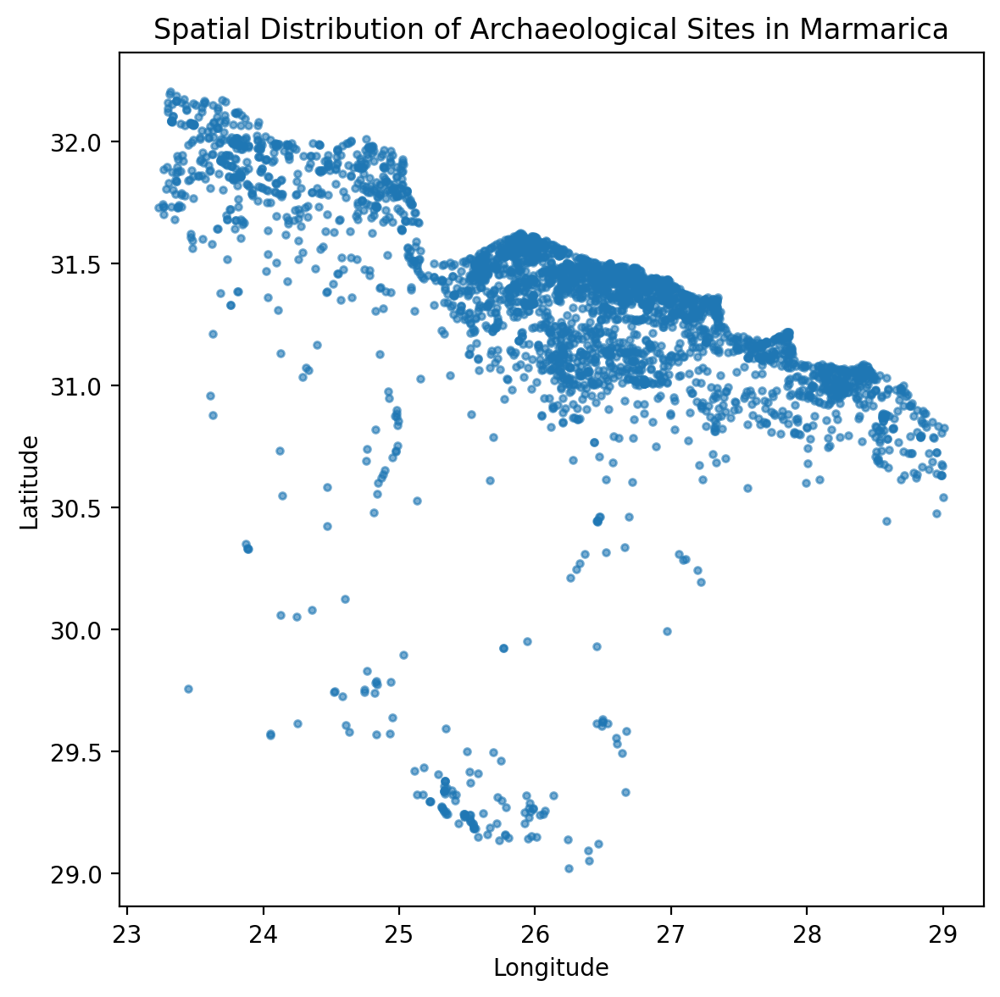
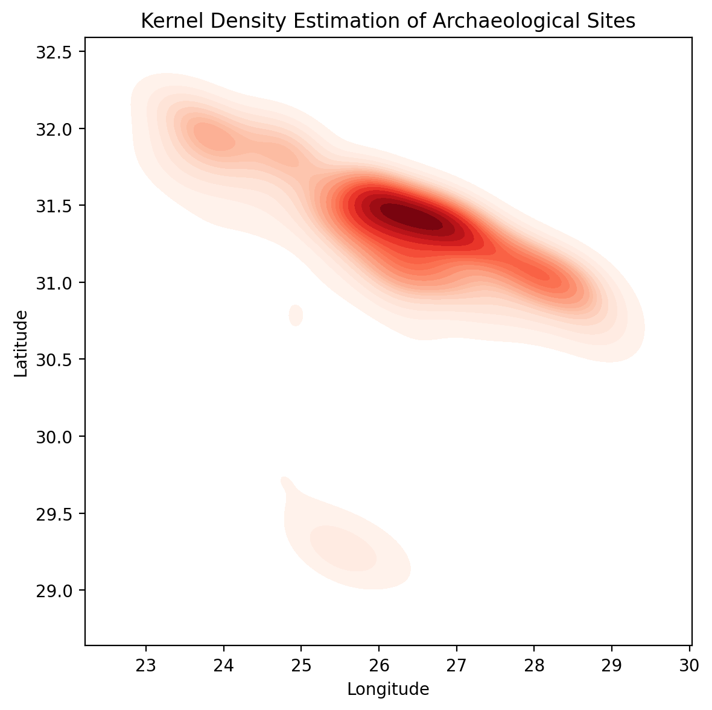
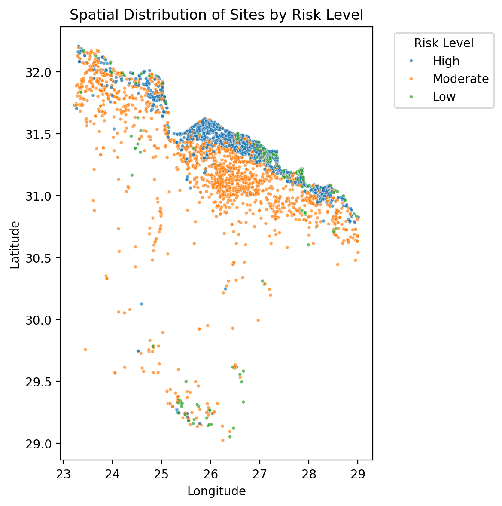
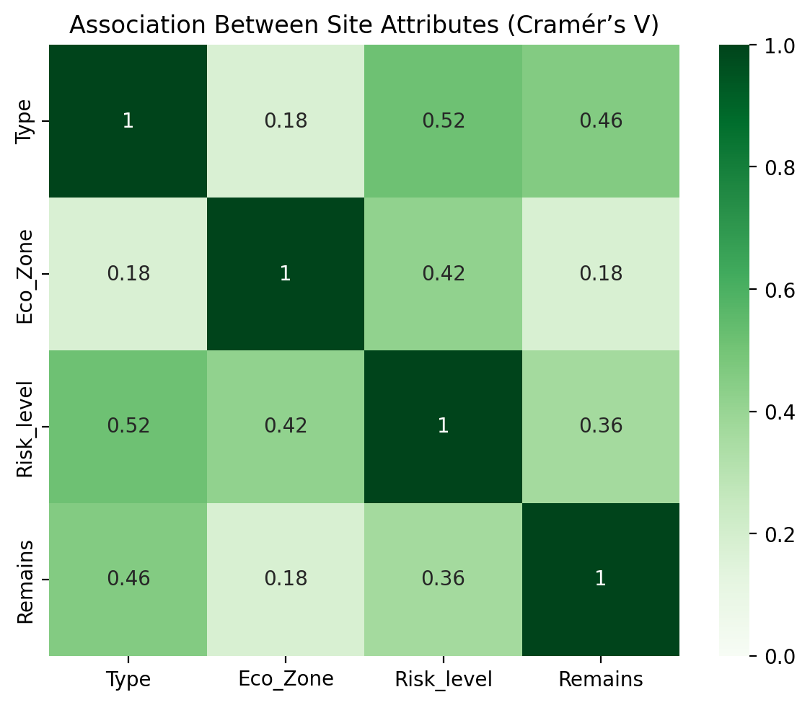
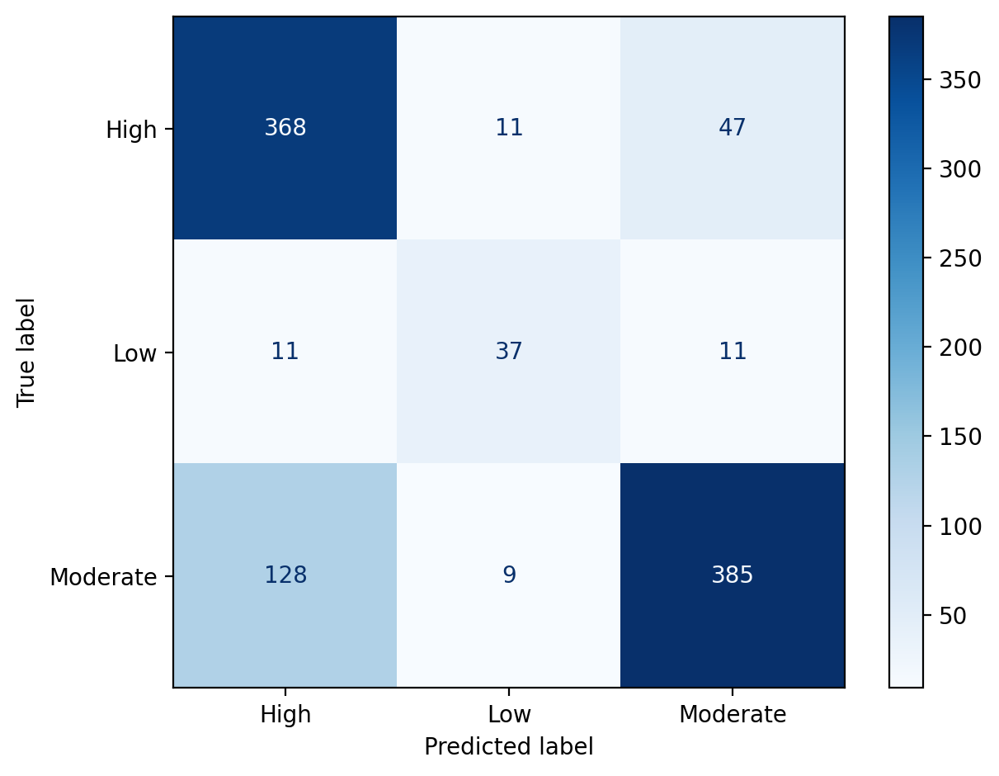
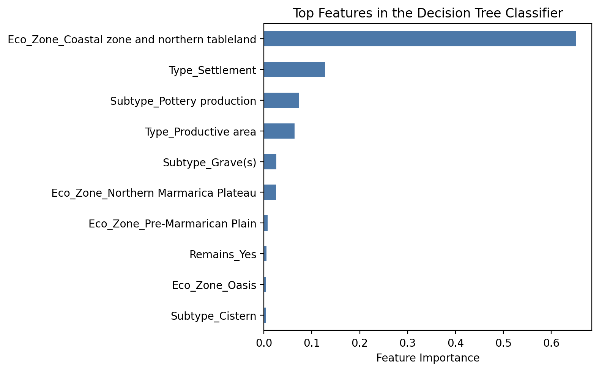

# Archaeological Site Risk Analysis in Marmarica

Spatial exploration and machine-learning analysis of **3,355 archaeological and cultural heritage sites** across the Marmarica region of northeastern Libya and northwestern Egypt.

This project examines whether recorded site attributes can support preliminary heritage-risk classification. It combines data-quality assessment, coordinate reconstruction, spatial visualization, categorical association analysis, and a comparison between decision-tree regression and classification.

## Key Finding

The **Decision Tree Classifier** was the more appropriate model for this dataset, reaching **0.785 accuracy** and a **0.742 macro F1-score**. A rounded Decision Tree Regressor produced lower classification performance and was conceptually less suitable because the target represents categorical management outcomes rather than a naturally continuous measurement.

## Research Questions

1. What data-quality issues must be resolved before the Marmarica site records can support spatial and machine-learning analysis?
2. How are archaeological sites and recorded risk levels distributed across the region?
3. Can site type, subtype, environmental zone, and visible remains help predict recorded risk level?
4. Should risk level be treated as an ordinal regression target or as a categorical classification target?

## Dataset

The project uses the **Marmarica archaeological spatial dataset**, which contains site locations and attributes spanning a long historical period from the Late Bronze Age to the Roman era.

Key fields include:

- Geographic coordinates
- Site type and subtype
- Environmental zone
- Coordinate accuracy and validation
- Visible remains
- Chronology
- Recorded risk type and risk level

The original dataset is available from [Zenodo (DOI: 10.5281/zenodo.7678852)](https://doi.org/10.5281/zenodo.7678852). The source data are not redistributed in this repository. See [`data/README.md`](data/README.md) for setup instructions.

## Workflow

### 1. Data-quality assessment

- Profiled 3,355 records across 18 original fields
- Distinguished explicit missing values from placeholders such as `Unknown` and `Undetermined`
- Found that **95.8% of chronology records** were marked as `Undetermined`
- Excluded fields that could not support reliable analysis within the current scope

### 2. Coordinate reconstruction

Many coordinate values contained multiple decimal points or inconsistent numeric patterns. The cleaning procedure:

1. Removed existing decimal points
2. Extracted the numeric sequence
3. Reinserted a decimal point after the first two digits
4. Validated longitude and latitude against the expected Marmarica geographic range

All reconstructed coordinates passed the regional range check.

### 3. Risk-label verification

The original `Risk_level` field contained `High`, `Moderate`, `Low`, and `Undetermined`, although the accompanying metadata defined only three official levels.

Records labelled `Undetermined` were checked against `Cod_Risk`. Because risk code 1 was defined as a low-level risk and no conflicting high or moderate cases were found, those records were reassigned to `Low` before modelling.

Final class distribution:

| Risk level | Records |
|---|---:|
| Moderate | 1,741 |
| High | 1,418 |
| Low | 196 |

### 4. Exploratory spatial analysis

Coordinate scatter plots and kernel density estimation were used to examine regional concentration. Additional maps compared spatial patterns by site type, environmental zone, recorded risk, visible remains, and survey zone.

| Site distribution | Kernel density estimation |
|:---:|:---:|
|  |  |

| Recorded risk levels | Categorical associations |
|:---:|:---:|
|  |  |

### 5. Machine-learning comparison

The models used four categorical predictors:

- `Type`
- `Subtype`
- `Eco_Zone`
- `Remains`

Categorical variables were one-hot encoded. A maximum tree depth of 6 was selected using four-fold cross-validation. The classifier used stratified splitting and stratified cross-validation to account for class imbalance.

| Approach | Metric | Result |
|---|---|---:|
| Decision Tree Classifier | Accuracy | **0.785** |
| Decision Tree Classifier | Balanced accuracy | **0.743** |
| Decision Tree Classifier | Macro F1 | **0.742** |
| Decision Tree Regressor | MAE | 0.351 |
| Decision Tree Regressor | RMSE | 0.450 |
| Rounded regressor | Accuracy | 0.746 |
| Rounded regressor | Macro F1 | 0.693 |

The classifier showed similar training and test accuracy, with no clear sign of overfitting at the selected depth.

| Classifier confusion matrix | Classifier feature importance |
|:---:|:---:|
|  |  |

## Interpretation

The classifier was preferred for two reasons:

1. **Empirical performance:** its accuracy and macro F1-score were higher than the corresponding metrics obtained by rounding regression outputs.
2. **Target meaning:** risk levels are categorical management outcomes derived from discrete risk types, not measurements on a continuous physical scale.

The modelling exercise therefore illustrates why algorithm choice should follow the meaning and construction of the target variable, rather than its apparent numerical order alone.

## Limitations

- The `Low` class contains only 196 records, creating substantial class imbalance.
- Risk level is an indirect label derived from underlying risk types.
- Chronological information is too incomplete for reliable temporal analysis.
- Coordinate plots and KDE provide exploratory views rather than formal spatial-statistical inference.
- No external variables such as elevation, hydrology, accessibility, modern land use, or population pressure were included.
- Survey coverage and recording practices may influence the observed spatial patterns.
- Results should not be interpreted as operational conservation recommendations.

Future work could predict individual risk types directly, incorporate environmental and modern land-use variables, and evaluate spatially aware validation strategies.

## Repository Structure

```text
.
├── README.md
├── .gitignore
├── requirements.txt
├── data/
│   └── README.md
├── notebooks/
│   └── marmarica_site_analysis.ipynb
└── results/
    ├── site-spatial-distribution.png
    ├── site-density-kde.png
    ├── risk-level-spatial-distribution.png
    ├── categorical-associations.png
    ├── classifier-confusion-matrix.png
    └── classifier-feature-importance.png
```

The raw and processed datasets remain local and are excluded through `.gitignore`.

## Reproducing the Analysis

After cloning or downloading the repository:

```bash
python3 -m venv .venv
source .venv/bin/activate
python -m pip install --upgrade pip
python -m pip install -r requirements.txt
```

Download the original dataset following [`data/README.md`](data/README.md), then launch JupyterLab from the repository root:

```bash
jupyter lab notebooks/marmarica_site_analysis.ipynb
```

Restart the kernel and run all cells to reproduce the cleaned dataset, metrics, and exported figures.

## Tools

- Python
- pandas and NumPy
- Matplotlib and seaborn
- SciPy
- scikit-learn
- JupyterLab
